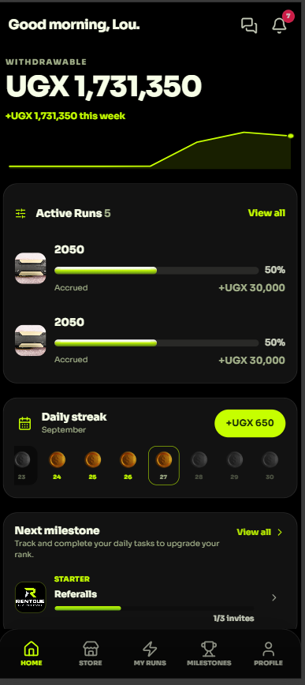
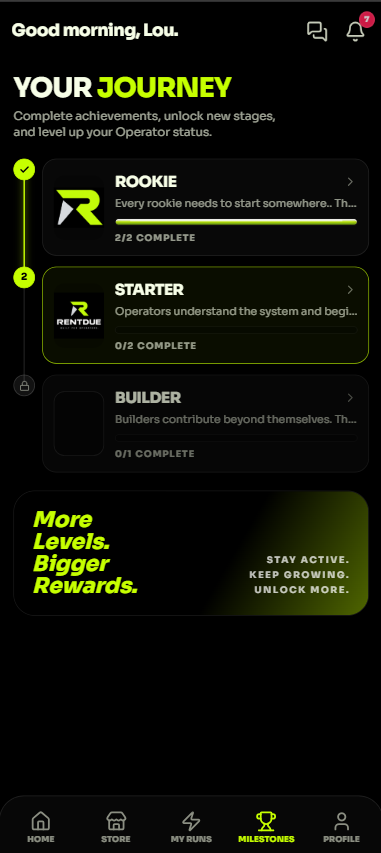
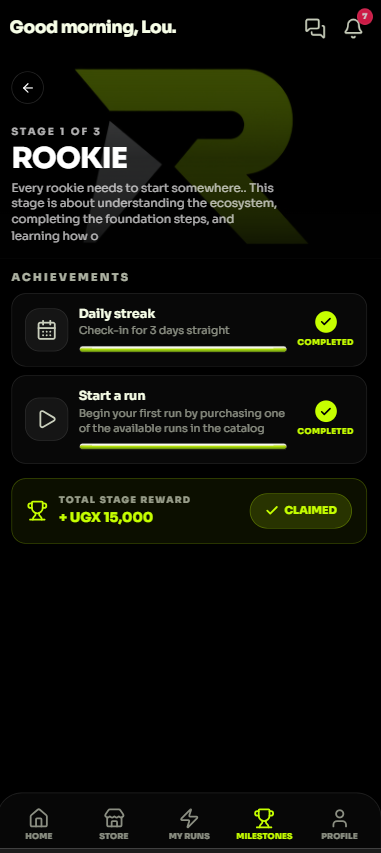

# Rentdue

Mobile-first referral-mining platform. Users recharge their account, activate product runs, earn daily yields, collect referral commissions, complete milestones and check-in streaks, then withdraw via mobile money or USDT. Includes a full admin dashboard for users, transactions, catalog, gift codes, announcements, milestones, and site configuration.

Built on Vite + React 19 + Express + Drizzle/MySQL + Cloudinary.

## Screenshots




## Quick Start
```bash
npm install
cp .env.example .env   # fill MYSQL_URL, OPENROUTER_*, PAYMENT_*, ADMIN_*, CLOUDINARY_*
npm run dev            # http://localhost:3000 (Express + Vite middleware, one process)
npm run build          # vite build + esbuild server.ts -> dist/
npm start              # node dist/server.cjs (production)
```

## How It Runs
Single Node process: `dist/server.cjs` serves the API and the built frontend from the same port. `dist/index.html` alone does nothing without the server behind it. Boot is self-provisioning — `ensureDatabaseSchema()` creates all tables, seeds `site_config`, and runs ledger reconciliations, so a fresh empty database is enough.

- Health: `/healthz` (liveness) · `/readyz` (readiness — 503 until DB init finishes, use this for host health checks)
- Scheduler hook: `GET /api/jobs/daily-credit?key=<DAILY_CREDIT_JOB_SECRET>` (idempotent; prefer an external cron over the in-process midnight job on sleeping hosts)
- Uploads: all site images go to Cloudinary (`CLOUDINARY_*` required — no local-disk fallback); the returned `secure_url` is saved in the DB

## Render Deployment (Web Service, not Static Site)
1. Create a hosted MySQL database (empty) and a Web Service from this repo.
2. Build command: `npm install && npm run build` · Start command: `npm start` · Health check path: `/readyz`.
3. Environment: `NODE_ENV=production`, `MYSQL_URL` (must include db name; add `DB_SSL=true` if the host requires TLS), `APP_URL` + `VITE_APP_URL` (service URL), `ADMIN_PHONE/ADMIN_PASSWORD/ADMIN_USERNAME` (clean values, no commas), `OPENROUTER_*`, `PAYMENT_*` (+ `PAYMENT_WEBHOOK_URL` on the service URL), `CLOUDINARY_*`.
4. After first green deploy, activate admin once: `POST /api/admin/access/activate` (one-shot — later `ADMIN_*` edits are ignored once seeded).

## SmarterASP Deployment (Node.js via IISNode)
1. Locally run `npm install`, then `npm run build` — verify `dist/server.cjs` exists next to `dist/index.html`.
2. Upload the project root layout as-is: `web.config` (root), `package.json`, `.env`, `dist/` (client + `server.cjs`), `node_modules/` (required — the bundle keeps packages external). Do NOT upload `src/`, never commit `.env`.
3. Enable Node.js in the panel, startup file `dist/server.cjs` (Node 20+). `PORT` comes from IIS; locally the server uses 3000.

## Admin
Set `ADMIN_PHONE/ADMIN_PASSWORD/ADMIN_USERNAME` in `.env`, then visit `#/admin/access/activate`.
